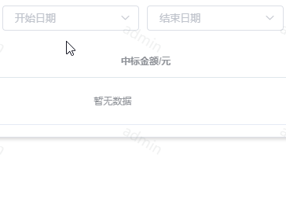

# el-date-slide-picker
基于element-ui实现的日期滑动选择器


效果演示: 



使用方法: 

```javascript
import elDateSlidePicker from "el-date-slide-picker";
Vue.use(elDateSlidePicker);
```

接下来，你就可以在页面中使用了

```html
<template>
    <div class="filter-item">
        <!-- 时间点 -->
        <el-date-slide-picker v-model="updateDate" />
        <!-- 时间段 -->
        <el-date-slide-picker-range size="mini" v-model="updateDateRange" />
    </div>
</template>
<script>
    export default {
        data () {
            return {
                updateDate: '2016-10-01', // 
                updateDateRange: ['2016-10-01', '2017-12-12']
            }
        }
    }
</script>
```

### 参数

#### el-date-slide-picker

**Select Attributes**


|    参数     | 说明             |  类型  |        可选值         | 默认值 |
| :---------: | ---------------- | :----: | :-------------------: | :----: |
| placeholder | 占位符           | String |           -           | 请选择 |
|    value    | 默认已选择数据项 | String |           -           |   无       |
|    size     | 尺寸             | String | medium / small / mini |   -    |
| selectRange | 时间范围 | Array | - | ['2016-01-01',  <至今>] |

**Select Events**

|    事件名称    | 说明                               |           回调参数            |
| :------------: | ---------------------------------- | :---------------------------: |
|     change     | 选中值发生变化时触发               |         目前的选中值          |

#### el-date-slide-picker-range

**Select Attributes**


|    参数     | 说明             |  类型  |        可选值         | 默认值 |
| :---------: | ---------------- | :----: | :-------------------: | :----: |
|    value    | 默认已选择数据项 | Array |           -           |   -      |
|    size     | 尺寸             | String | medium / small / mini |   -    |
| selectRange | 时间范围 | Array | - | ['2016-01-01',  <至今>] |

**Select Events**

|    事件名称    | 说明                               |           回调参数            |
| :------------: | ---------------------------------- | :---------------------------: |
|     change     | 选中值发生变化时触发               |         目前的选中值          |

